## **Online Store - Order Management Service**
This project is a simple RESTful web service for managing orders in an online store, built with Spring Boot 3.

Technologies Used:
- **Java 17**
- **Spring Boot 3.0**
- **Spring Data JPA**
- **Apache Maven 3.6+**
- **H2 Database** (for Development)
- **PostgreSQL** (for Production)
- **OpenAPI (Swagger)** for API documentation

## Project Structure
The project follows a standard Maven project structure:
````
.
├── .gitattributes
├── .gitignore
├── .idea                    # IDE configuration files
├── .mvn
│   └── wrapper
│       └── maven-wrapper.properties
├── HELP.md
├── images
├── mvnw                     # Maven wrapper script (Linux/macOS)
├── mvnw.cmd                 # Maven wrapper script (Windows)
├── pom.xml                  # Maven configuration
├── Quote Web Applications.pdf
├── README.md
├── run.bat
├── run.sh
├── Sprint1_3350.zip
├── Sprint2_3350.zip
├── target                   # Compiled code and package output
└── src
    ├── main
    │   ├── java
    │   │   └── com/sofipguz/Challenge5
    │   │       ├── Challenge5Application.java # Main application class
    │   │       ├── controller
    │   │       │   └── OrderController.java   # REST Controller
    │   │       ├── exception                  # Implement Global Exception Handling 
    │   │       │   └── GlobalExceptionHandler  # Returns a clean JSON with all fields that failed validation 
    │   │       │   └── OrderNotFoundException   # Spring returns a 404 if the exception is not caught
    │   │       ├── module                     # (Often named 'model') Data entities
    │   │       │   └── Order.java
    │   │       ├── repository
    │   │       │   └── OrderRepository.java   # Spring Data Repository Interface
    │   │       └── service
    │   │           └── OrderService.java      # Business logic service
    │   └── resources
    │       └── ...                          # (e.g., application.properties)
    └── test
        └── java
            └── com/sofipguz/Challenge5
                └── Challenge5ApplicationTests.java # Test class
````
### Project Scope and Quote
The detailed breakdown of the scope of work, Sprint deliverables, and formal quote: **[see the Scope and Quote here](./Quote%20Web%20Applications.pdf)**

### 1. Clone the Repository
```bash
git clone <git@github.com:SofGuzman-Mx/Spring-and-Spring-Boot-in-Java-for-Web-Applications.git>
cd order-service
```

These scripts provide a robust way to build and run your application across different operating systems while easily switching between configuration profiles.<br/>

## How to Run the Application
The application will be available at `http://localhost:8080`.
### Script for Windows
How to use `run.bat`:<br/>
1.Save the code above as run.bat in your project's root directory.<br/>
2.Open a Command Prompt or PowerShell window.<br/>
3.Run the script by providing a profile:
```
run.bat dev
```
or
```
run.bat prod
```
4.If you run it without arguments (`run.bat`), it will prompt you to enter a profile.


### Script for Linux/macOS
How to use `run.sh`:<br/>
1.Save the code above as run.sh in your project's root directory.<br/>
2.Make the script executable by running this command in your terminal:
```Shell Script
chmod +x run.sh
```
3.Run the script by providing a profile:
```Shell Script
./run.sh dev
```
or
```Shell Script
./run.sh prod
```
4.If you run it without arguments (`./run.sh`), it will prompt you to enter a profile.

## API Documentation
Once the application is running, you can access the interactive Swagger UI documentation here:
[http://localhost:8080/swagger-ui.html](http://localhost:8080/swagger-ui.html)

**How to run**
1.Clone the repository

2.Run spring-boot:
````
.\mvnw spring-boot:run
````
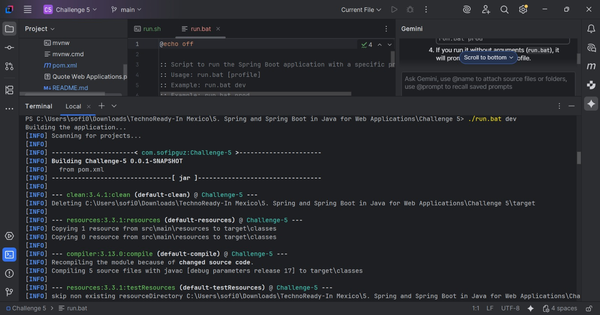

3.Run the Application
First, make the script executable:
````
chmod +x starup.sh
````
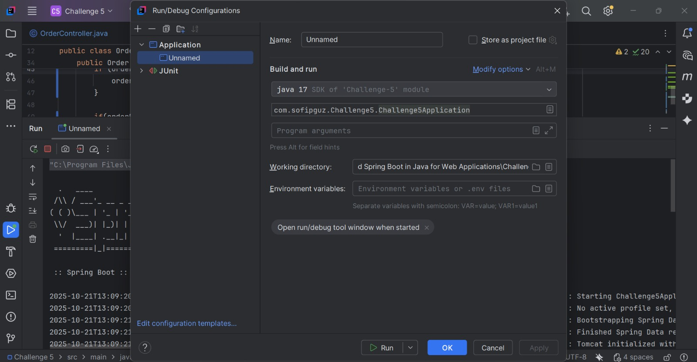

Then, run it:
````
./startup.sh
````
Running directly:
````
java -jar target/online-store-0.0.1-SNAPSHOT.jar
````

## API Endpoints tested with Postman
- `POST /api/orders`: Create a new order.
  
- `GET /api/orders`: Get a list of all orders.
  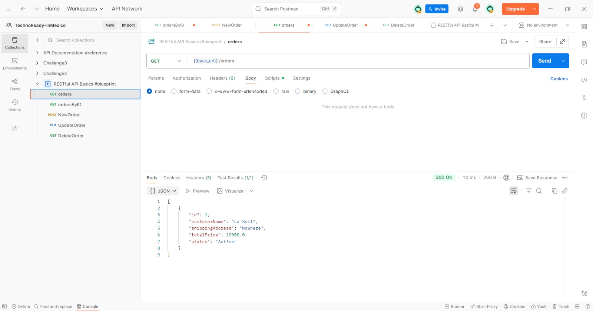
- `GET /api/orders/{id}`: Get a single order by its ID.
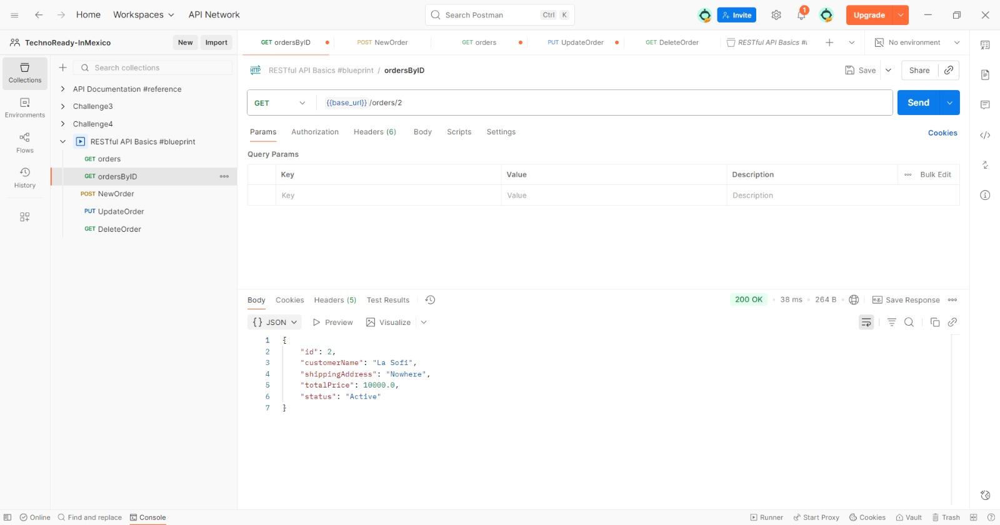
- `PUT /api/orders/{id}`: Update an existing order.
  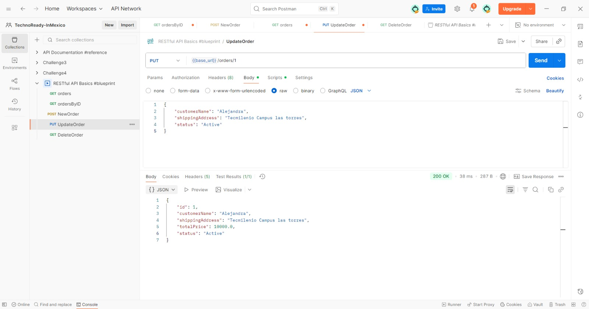
- `DELETE /api/orders/{id}`: Delete an order.

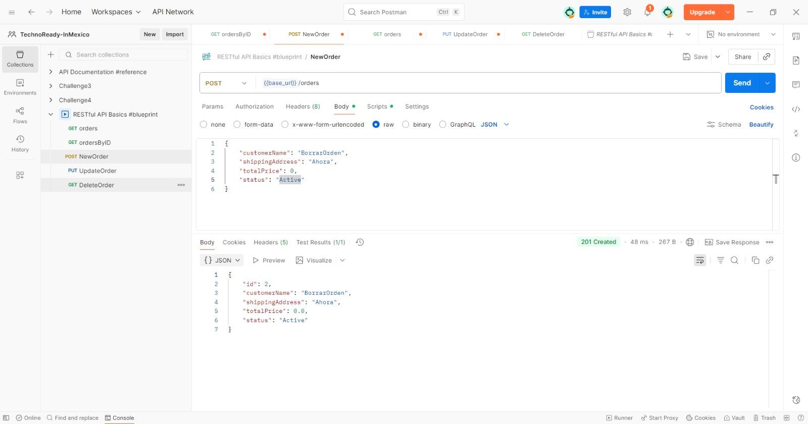
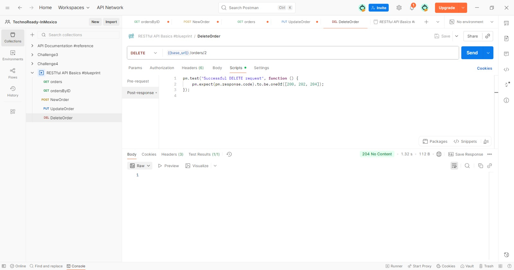

## Swagger
Adding a Swagger UI will create live, interactive documentation for your API, making it incredibly easy for you and others to understand and test the work.
## API Documentation (Swagger)

To facilitate testing and visualization of endpoints, this project uses Swagger (OpenAPI).

### Access

1.  Ensure that the application is running locally.
2.  Open your browser and go to the following URL:

    `http://localhost:8080/swagger-ui/index.html`

## Features

From this interface, you can:
### View all available API endpoints (`GET`, `POST`, `PUT`, `DELETE`).
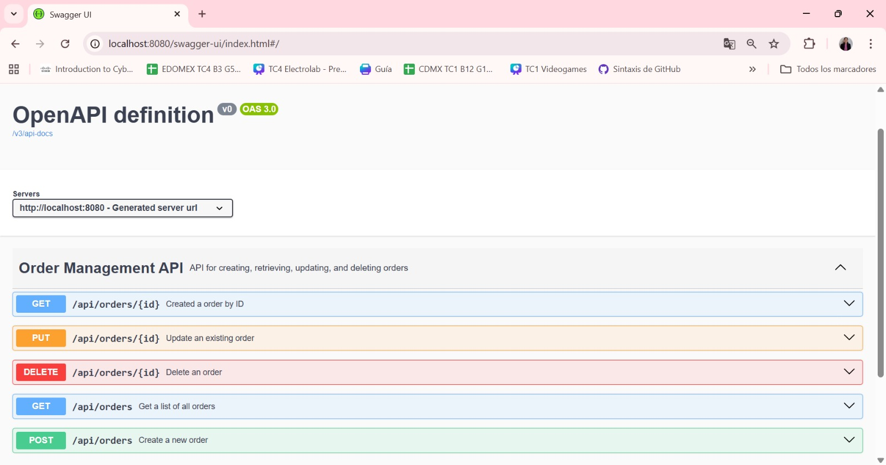<br/>
<br/>
### Test each endpoint interactively.

**Testing PUT**
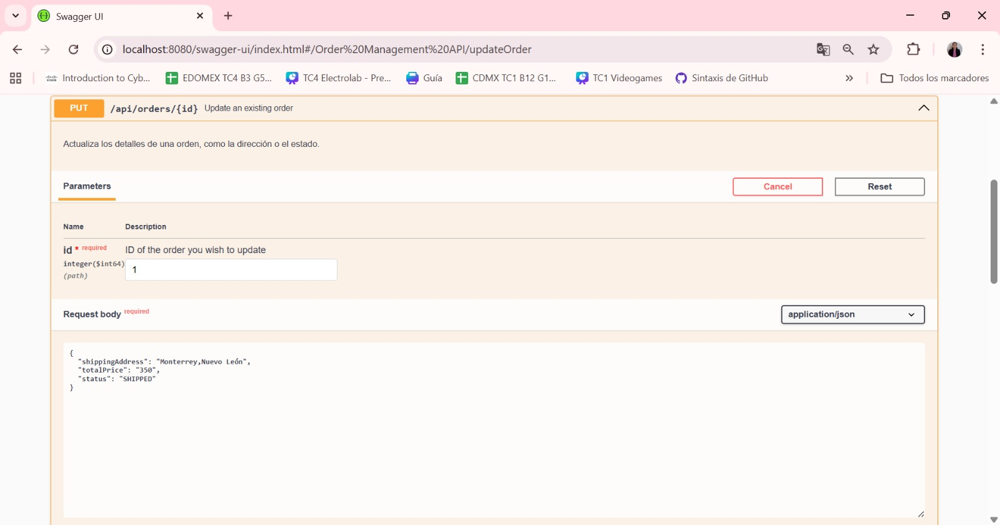
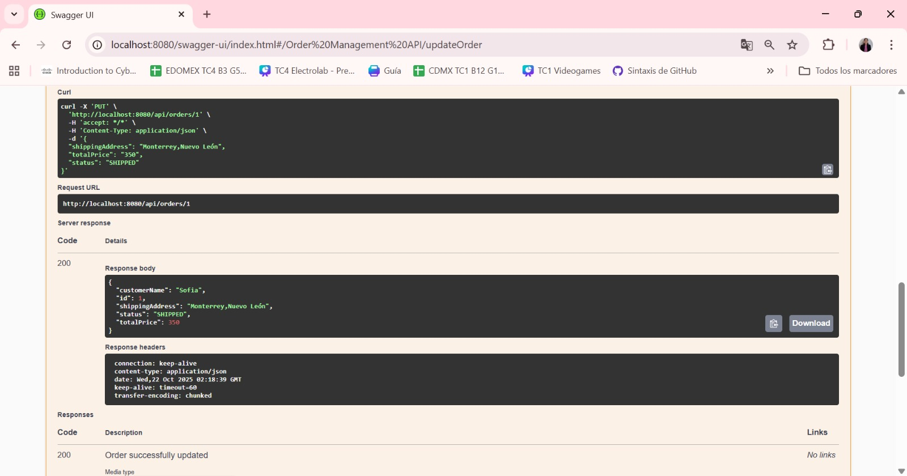
<br/>
**Testing POST**
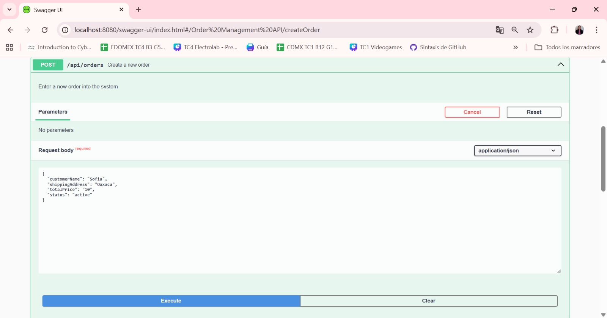
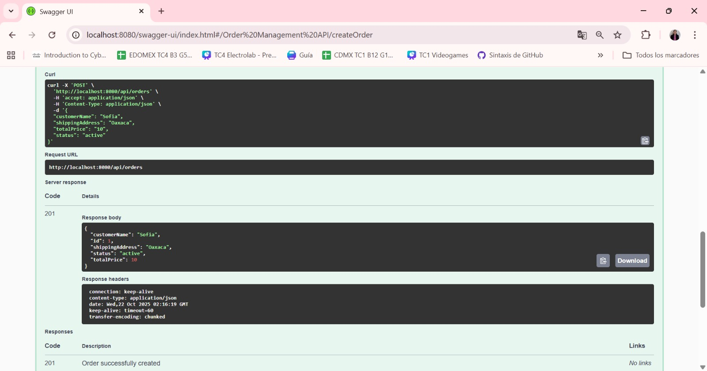
With this I proved this API and don't crashes with a 500 error, its inputs are validate
### View the expected data models (schemas) for requests and responses.
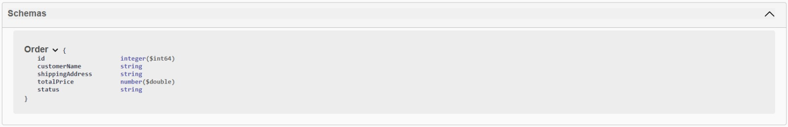

Our team appreciated feedback on Sprint 1 and 2 regarding the implementing of Stability and Security as an important High priority thing. That's why we implement Input Validation in our `pom.xml`, we add the dependency `spring-boot-starter-validation`. In the entity `Order.java` we added annotation to the fields and in OrderController.java we added `@Valid` to the `RequestBody`. Also we took action implementing Global Exception Handling as you can see in our package `exception` we created two classes to catch specific errors (such as `MethodArgumentNotValidException` for `@Valid` and return a clean JSON response (a 400 or 404 error, rather than a 500).
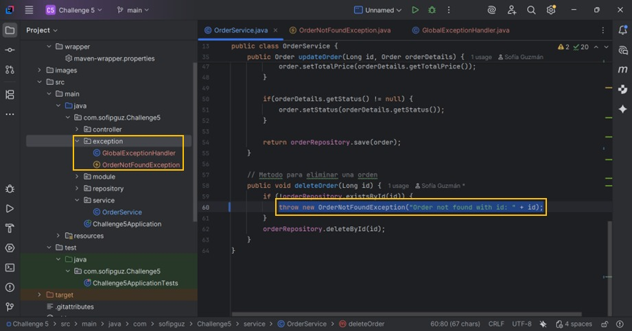
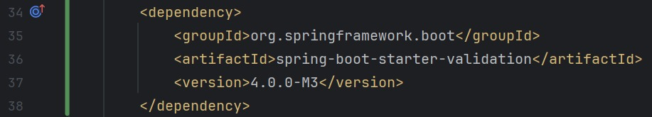
## 1. Innovation and Project Value
This service is not just a CRUD; it's the central transaction engine for an e-commerce platform. The innovation in this project lies in its reliability and scalability.

### Technical Aspects Applicability (Reliability)
The technical improvements implemented have a direct impact on the business:

- **Input Validation (@Valid)**: By validating data before it touches the database (e.g., a negative totalPrice or an invalid status), we prevent data corruption. This is an innovation in reliability, saving costs and support time by preventing erroneous orders from being processed.
- **Global Exception Handling (@ControllerAdvice)**: Instead of generic 500 errors, the API informs the client exactly what went wrong (e.g., 404 Not Found or 400 Bad Request). This enables front-end systems to react and display useful messages to the user, improving their experience.

### Scalability and Sustainability (Future-Ready)
This project is designed to grow:

- **Scalability**: (You mention pagination here, although it's not implemented yet). A GET /api/orders endpoint without pagination works with 100 orders but would collapse with 10 million. The repository design is prepared to implement Pagination (PagingAndSortingRepository), allowing the service to handle a 1000x growth in order volume without degrading performance.
- **Sustainability and Economic Viability**: Using Profiles (dev/prod) and dual database support (H2 / PostgreSQL) is key. It allows the development team to test and validate locally (with H2) without cost and risk. At the same time, it ensures that deployment to production (with PostgreSQL) is robust, predictable, and high-performance. This reduces infrastructure costs and accelerates time-to-market.

## 2.Narrative and Impact
How does we communicate the value of the project and demonstrate leadership?
### Leadership and Team Enablement (Developer Experience)
A successful project isn't just about the code; it's about how easily other developers can understand, use, and contribute to it. This README.md, along with Swagger documentation, acts as a technical leadership tool. By providing:

- Execution scripts (run.bat, run.sh)
- Clear profile configuration (dev/prod)
- Interactive API documentation (Swagger)
- Visual test examples (Postman)

A new team member can get the project up and running and be productive in minutes, not days. This reduces friction, accelerates development, and fulfills the goal of "guiding others" in using the skill.


